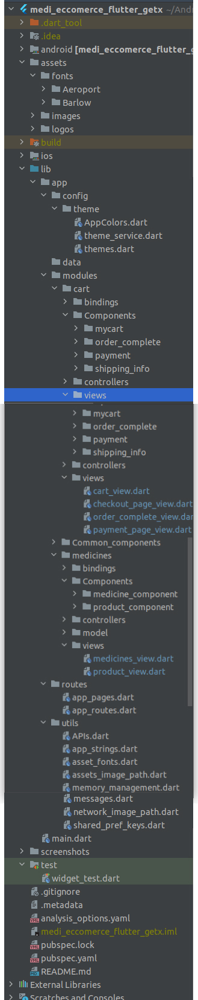
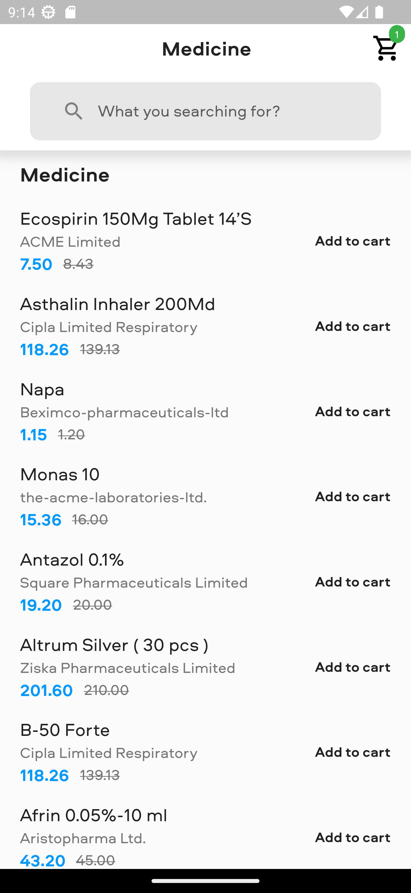
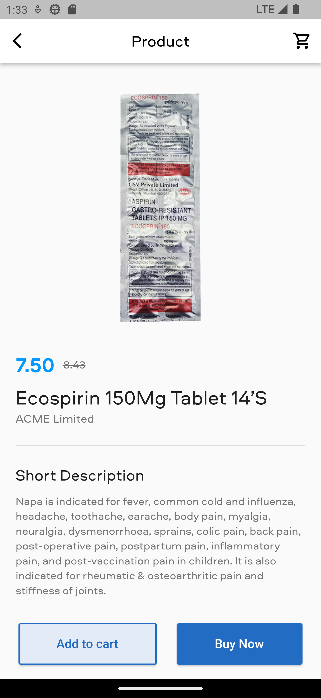
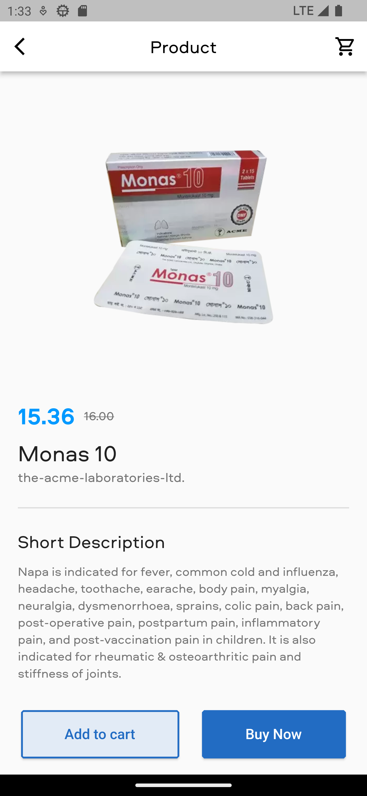
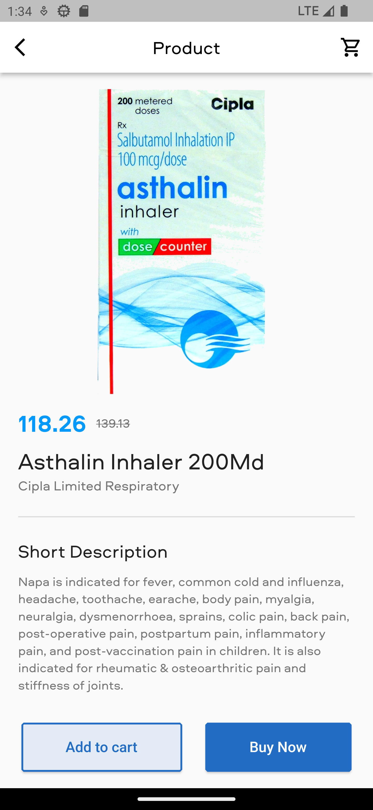
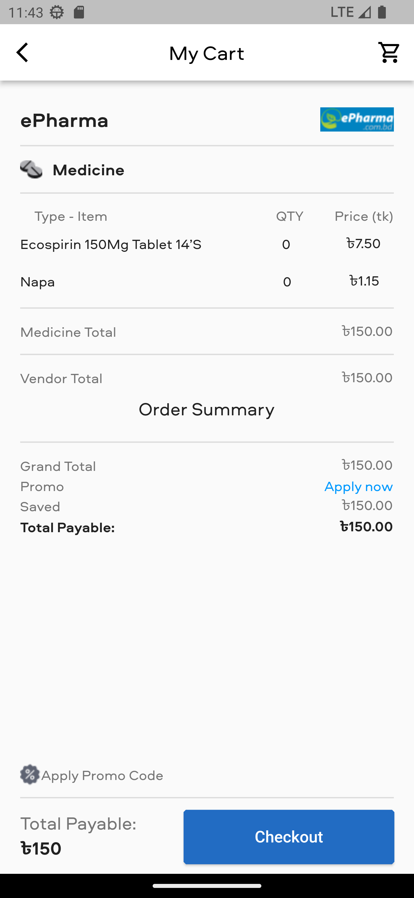
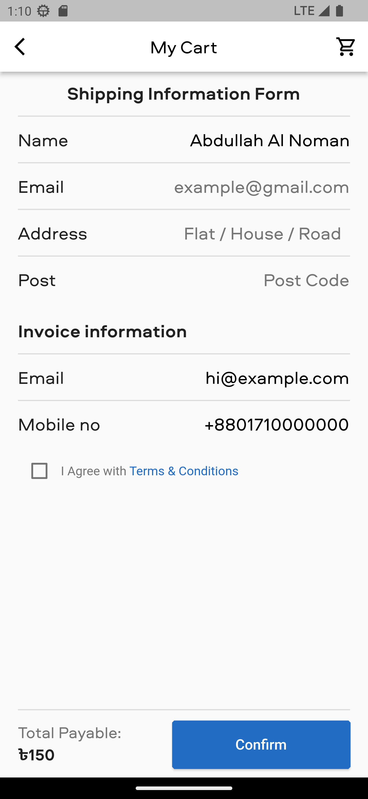
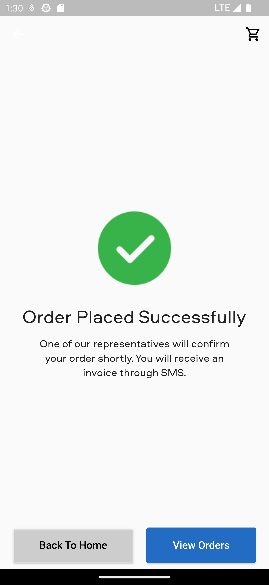

# medi_eccomerce_flutter_getx

A new Flutter project.
<br/>
<br/>
&nbsp;&nbsp;
&nbsp;&nbsp;
<a href="https://choosealicense.com/licenses/mit/" target="_blank"></a>&nbsp;&nbsp;
&nbsp;&nbsp;


# GetX Clean Architecture

A Flutter Clean Architecture Using [GetX](https://github.com/jonataslaw/getx).

This repo is forked from: https://github.com/phamdinhduc795397/flutter-getx-clean-architecture


## Project Structure

</img>

```
    lib
    ├── app
    │   ├── config
    │   │   └── (...)
    │   ├── core
    │   │   └── usecases
    │   │       ├── no_param_usecase.dart
    │   │       └── pram_usecase.dart
    │   ├── extensions
    │   │   └── color.dart
    │   ├── services
    │   │   └── local_storage.dart
    │   ├── types
    │   │   ├── category_type.dart
    │   │   └── tab_type.dart
    │   └── util
    │       ├── dependency.dart
    │       └── util.dart
    ├── data
    │   ├── models
    │   │   └── (...)
    │   ├── providers
    │   │   ├── database
    │   │   │   └── firebase_database_provider.dart
    │   │   └── network
    │   │       ├── apis
    │   │       │   └── auth_api.dart
    │   │       └── (...)
    ├── modules
    │   ├── cart
    │   │   ├── bindings
    │   │   ├── components
    │   │   ├── controllers
    │   │   └── views
    │   ├── medicines
    │   │   ├── bindings
    │   │   ├── components
    │   │   ├── controllers
    │   │   └── views
    │   ├── common_components
    │   │   └── news
    │   │
    │   └── app.dart
    ├── generated_plugin_registrant.dart
    └── main.dart
```
<br/>
<br/>
<br/>
<br/>
<br/>
<br/>
<br/>
<br/>
<br/>
<br/>
<br/>
<br/>
<br/>
<br/>
<br/>
<br/>
<br/>
<br/>
<br/>
<br/>
<br/>
<br/>
<br/>
<br/>
<br/>
<br/>
<br/>
<br/>
<br/>
<br/>

## ScreenShots of these application
<br /> 








<br /> 
